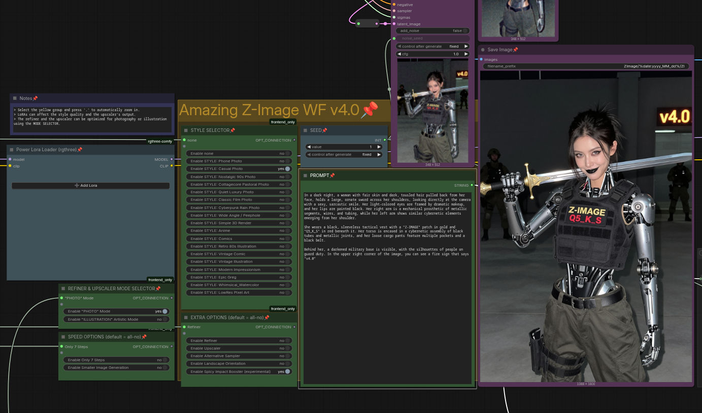
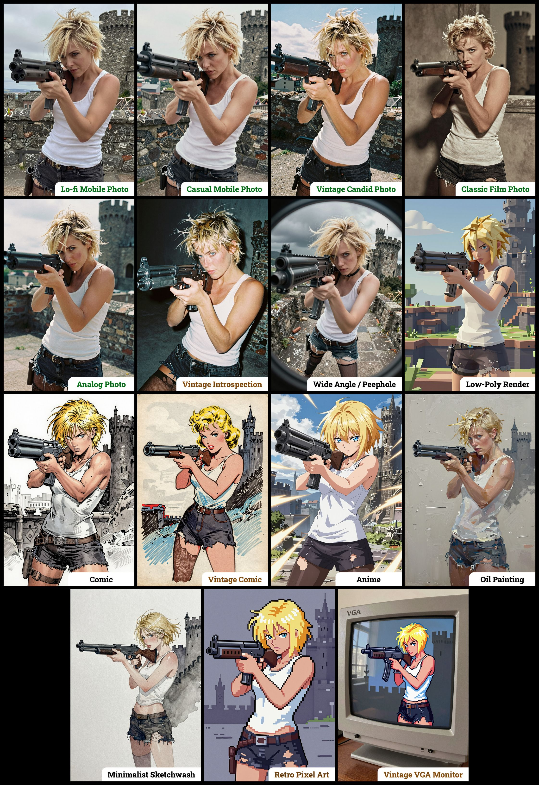
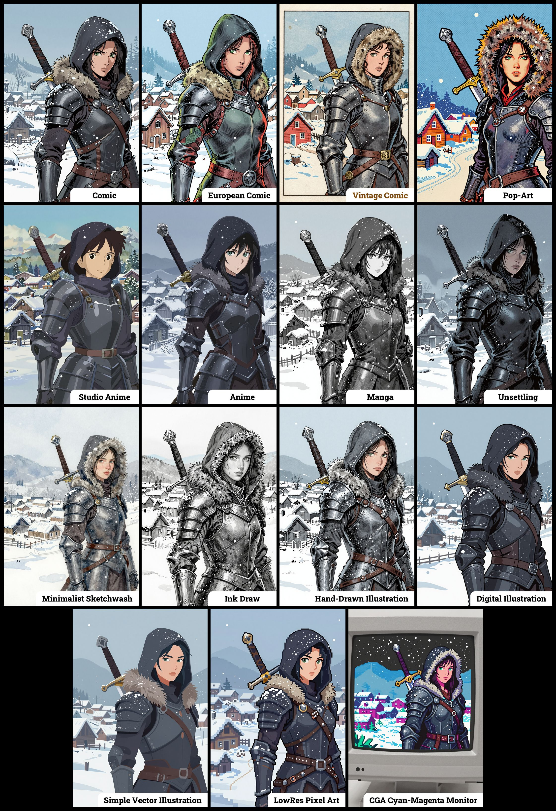

# Amazing Z-Image Workflow v3.0

 \

 \
</img>

A workflow for [Z-Image-Turbo](https://github.com/Tongyi-MAI/Z-Image) extending the ComfyUI base workflow with additional features, particularly focused on high-quality image styles and ease of use. The repository includes pre-configured workflows for GGUF and SAFETENSORS formats.

## Table of Contents
1. [Features](#features)
2. [Workflows Overview](#workflows-overview)
3. [Required Custom Nodes](#required-custom-nodes)
4. [Required Checkpoints Files]([#required-checkpoints-files)
   - [For "amazing-z-###_GGUF.json"](#for-amazing-z-_ggufjson)
   - [For "amazing-z-###_SAFETENSORS.json"](#for-amazing-z-_safetensorsjson)
   - [For Low-VRAM Systems](#for-low-vram-systems)
5. [License](#license)

## Features
- **Style Selector**: Choose from fifteen customizable image styles.
- **Alternative Sampler Switch**: Easily test generation with an alternative sampler. 
- **Landscape Orientation Switch**: Change to horizontal image generation with a single click.
- **Z-Image Enhancer (v3.0+)**: Improves final image quality by performing a double pass.
- **Spicy Impact Booster (v3.0+)**: Adds a subtle spicy condiment to the prompt (fully experimental).
- **Smaller Images Switch (v3.0+)**: Generate smaller images, faster and consuming less VRAM.
     - Default image size: __1600 x 1088 pixels__
     - Smaller image size: __1216 x 832 pixels__
     - (previous versions up to v2.2 used a fixed setting of 1408 x 944 pixels)
- Preconfigured workflows for each checkpoint format (GGUF / SAFETENSORS).
- Custom sigma values fine-tuned to my personal preference (100% subjective).
- Generated images are saved in the "ZImage" folder, organized by date.
- Incorporates a trick to enable automatic CivitAI prompt detection.

### The 15 Predefined Styles in "amazing-z-image"
</img>

### The 15 Predefined Styles in "amazing-z-comics"
</img>

### The 15 Predefined Styles in "amazing-z-photo"
</img>

## Workflows Overview

The available styles are organized into workflows based on their focus:

* __`amazing-z-image`__ : The original general-purpose workflow with a variety of image styles.
* __`amazing-z-comics`__: Workflow dedicated to illustration (comics, anime, pixel art, etc.).
* __`amazing-z-photo`__ : Workflow dedicated to photographic images (phone, vintage, production photos, etc.).

Each of these workflows comes in two versions, one for GGUF checkpoints and another for SafeTensors. 

This is reflected in the filenames:

* __`amazing-z-###_GGUF.json`__       : Recommended for GPUs with 12GB or less VRAM.
* __`amazing-z-###_SAFETENSORS.json`__: Based directly on the ComfyUI example.

When using ComfyUI, you may encounter debates about the best checkpoint format. From my experience, GGUF quantized models provide a better balance between size and prompt response quality compared to SafeTensors versions. However, it's worth noting that ComfyUI includes optimizations that work more efficiently with SafeTensors files, which might make them preferable for some users despite their larger size. The optimal choice depends on factors like your ComfyUI version, PyTorch setup, CUDA configuration, GPU model, and available VRAM and RAM. To help you find the best fit for your system, I've included links to various checkpoint versions below.

## Required Custom Nodes

These nodes can be installed via [ComfyUI-Manager](https://github.com/Comfy-Org/ComfyUI-Manager) or downloaded from their respective repositories.

 - **[rgthree-comfy](https://github.com/rgthree/rgthree-comfy)**: Required for both workflows.
 - **[ComfyUI-GGUF](https://github.com/city96/ComfyUI-GGUF)**: Required if you are using the workflow preconfigured for GGUF checkpoints.

## Required Checkpoints Files

### For "amazing-z-###_GGUF.json"

Using **Q5_K_S** quants, you will likely achieve the best balance between file size and prompt response.

 - __[z_image_turbo-Q5_K_S.gguf](https://huggingface.co/jayn7/Z-Image-Turbo-GGUF/blob/main/z_image_turbo-Q5_K_S.gguf)__ [5.19 GB]\
   Local Directory: __`ComfyUI/models/diffusion_models/`__
 - __[Qwen3-4B.i1-Q5_K_S.gguf](https://huggingface.co/mradermacher/Qwen3-4B-i1-GGUF/blob/main/Qwen3-4B.i1-Q5_K_S.gguf)__ [2.82 GB]\
   Local Directory: __`ComfyUI/models/text_encoders/`__
 - __[ae.safetensors](https://huggingface.co/Comfy-Org/z_image_turbo/blob/main/split_files/vae/ae.safetensors)__ [335 MB]\
   Local Directory: __`ComfyUI/models/vae/`__
 - __[4x_Nickelback_70000G.safetensors](https://huggingface.co/martin-rizzo/ESRGAN-4x/blob/main/4x_Nickelback_70000G.safetensors)__ (for image enhancer) [66.9 MB]\
   Local Directory: __`ComfyUI/models/upscale_models/`__
 - __[4x_foolhardy_Remacri.safetensors](https://huggingface.co/martin-rizzo/ESRGAN-4x/blob/main/4x_foolhardy_Remacri.safetensors)__ (for image enhancer) [66.9 MB]\
   Local Directory: __`ComfyUI/models/upscale_models/`__
   

### For "amazing-z-###_SAFETENSORS.json"

While it may require 12GB of VRAM or more to run smoothly, ComfyUI's optimizations may allow it to work well on your system.

 - __[z_image_turbo_bf16.safetensors](https://huggingface.co/Comfy-Org/z_image_turbo/blob/main/split_files/diffusion_models/z_image_turbo_bf16.safetensors)__ (12.3 GB)\
   Local Directory: __`ComfyUI/models/diffusion_models/`__
 - __[qwen_3_4b.safetensors](https://huggingface.co/Comfy-Org/z_image_turbo/blob/main/split_files/text_encoders/qwen_3_4b.safetensors)__ (8.04 GB)\
   Local Directory: __`ComfyUI/models/text_encoders/`__
 - __[ae.safetensors](https://huggingface.co/Comfy-Org/z_image_turbo/blob/main/split_files/vae/ae.safetensors)__ (335 MB)\
   Local Directory: __`ComfyUI/models/vae/`__
 - __[4x_Nickelback_70000G.safetensors](https://huggingface.co/martin-rizzo/ESRGAN-4x/blob/main/4x_Nickelback_70000G.safetensors)__ (for image enhancer) [66.9 MB]\
   Local Directory: __`ComfyUI/models/upscale_models/`__
 - __[4x_foolhardy_Remacri.safetensors](https://huggingface.co/martin-rizzo/ESRGAN-4x/blob/main/4x_foolhardy_Remacri.safetensors)__ (for image enhancer) [66.9 MB]\
   Local Directory: __`ComfyUI/models/upscale_models/`__

### For Low-VRAM Systems

If neither of the two provided versions nor their associated checkpoints perform adequately on your system, you can find links to several alternative checkpoint files below. Feel free to experiment with these options to determine which works best for you.

#### Diffusion Models (ComfyUI/models/diffusion_models/)

*   **[Z-Image-Turbo (GGUF Quantizations)](https://huggingface.co/jayn7/Z-Image-Turbo-GGUF/tree/main)**
    This repository hosts various quantized versions of the `z_image_turbo` model (e.g., Q4_K_S, Q4_K_M, Q3_K_S). While some of these quantizations offer significantly reduced file sizes, this often comes at the expense of final output quality.

*   **[Z-Image-Turbo (FP8 SafeTensors)](https://huggingface.co/T5B/Z-Image-Turbo-FP8/tree/main)**
    Similar to the GGUF options, this repository provides two `z_image_turbo` models quantized to FP8 (8-bit floating point) in SafeTensors format. These can serve as replacements for the original SafeTensors model, but in my opinion, they degrade quality quite a bit.

#### Text Encoders (ComfyUI/models/text_encoders/)

*   **[Qwen3-4B (Various GGUF Quantizations)](https://huggingface.co/mradermacher/Qwen3-4B-i1-GGUF/tree/main)**
    This repository offers various quantized versions of the `Qwen3-4B` text encoder in GGUF format (e.g., Q2_K, Q3_K_M). **Note:** Quantizations beginning with "IQ" might not work, as the GGUF node did not support them during my testing.

## License

This project is licensed under the Unlicense license.\
See the ["LICENSE"](LICENSE) file for details.

